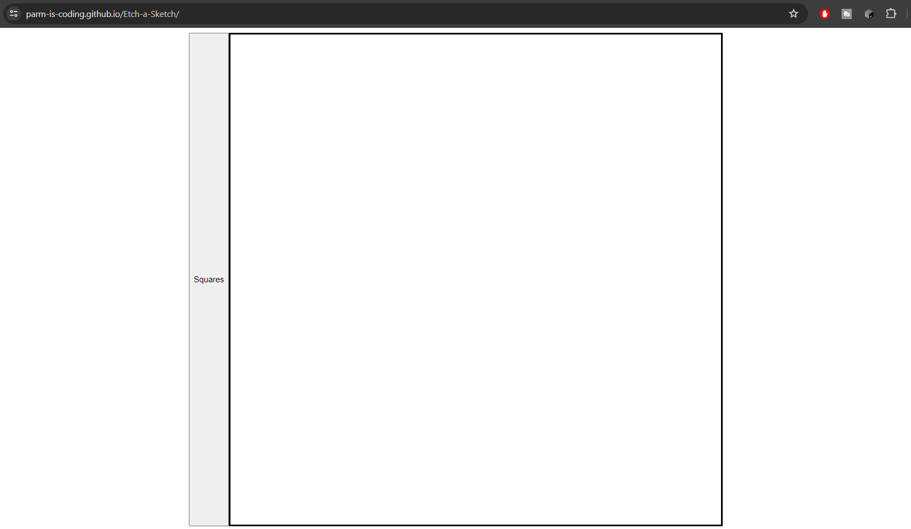

# Etch-a-Sketch
This project is a simple web application that creates a grid of squares on a webpage. The size of the grid is determined by user input.

File: index.html
This is the main HTML file for the project. It sets up the basic structure of the web page and includes a button with the id squares and a div with the id container.

File: app.js
This JavaScript file contains the logic for creating the grid of squares.

Variables
container: This constant is a reference to the HTML element with the id container.
grid: This variable is used to store the grid that is created.
button: This constant is a reference to the HTML element with the id squares.
Functions
getPadding(numSquares): This function calculates the padding for each square in the grid. It takes the number of squares as an argument and returns a string representing the padding in pixels.

createRow(num): This function creates a row of squares. It takes the number of squares as an argument. It creates a div for each square, adds an event listener to change the square's background color on mouseover, and appends the square to the row. It returns the row.

createGrid(num): This function creates a grid of squares. It takes the number of squares as an argument. It creates a row for each square and appends the row to the grid. It returns the grid.

getInput(): This function is currently empty and does not perform any actions.

Event Listeners
button: An event listener is added to the button. When the button is clicked, it prompts the user for the number of squares, removes the old grid from the container, creates a new grid with the specified number of squares, and appends the new grid to the container.